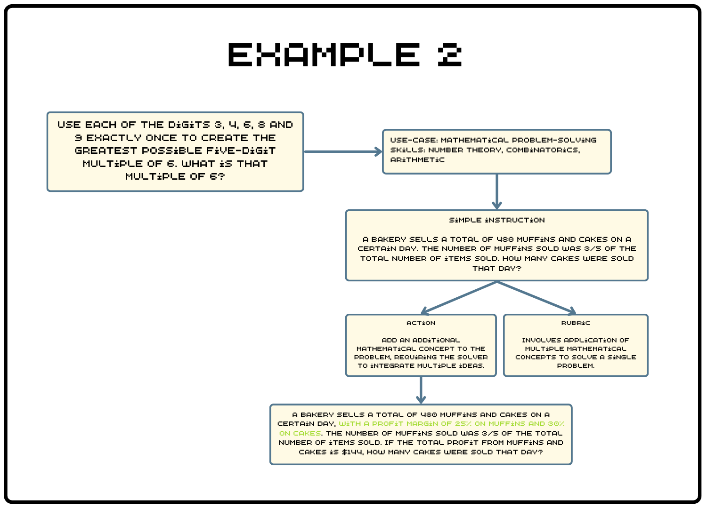

# synth. 🧙🏼 - pipeline for generating synthetic instructions for LLMs training

<div align="center">
  
</div>

___

## **Table of contents**
- [Usage](#usage)
- [CodecLLM pipeline overview](#codecllm-pipeline-overview)
- [Results](#results)
- [Examples](#examples)
- [Supported engines](#supported-engines)
- [References](#references)
- [License](#license)

___

## **Usage**

### Step 1. Clone the repository and install the requirements

```bash
# Clone the repository
git clone git@github.com:aboros98/synth.git

# (Optional) Create a virtual environment
python3 -m venv venv
source venv/bin/activate  # On Windows use `venv\Scripts\activate`

# Install the requirements
pip install -r requirements.txt
```

### Step 2. Export the API key - Set your API key based on the engine you are using:

```bash
export [OPENAI_API_KEY | TOGETHER_API_KEY | ANTHROPIC_API_KEY | MISTRAL_API_KEY]=<your_api_key>
```

### Step 3. Create your config

```yaml
# Example configuration using the OpenAI engine:
strong_model:
  engine: openai
  model: gpt-4
  seed: 42
  generation_config:
    max_tokens: 4096
    temperature: 0.7
    top_p: 0.9

target_model:
  engine: openai
  model: gpt-3.5-turbo
  seed: 42
  generation_config:
    max_tokens: 4096
    temperature: 0.7
    top_p: 0.9

judge_model:
  engine: openai
  model: gpt-4o
  seed: 42
  generation_config:
    max_tokens: 512
    temperature: 0.0
    top_p: 1.0

pipeline:
  n_instructions: 2
  n_rubrics: 4
  n_iterations: 4
  margin_threshold: 0.5
  output_path: <path_to_output>
  dataset_path: <local_path_or_huggingface_dataset>
```

### Step 4. Run the pipeline

```bash
python main.py -c <path_to_config_file> -p <number_of_parallel_processes>
```

___

## **CodecLLM pipeline overview**

<div align="center">
  
  <p><em><a href="https://arxiv.org/pdf/2404.05875">Figure 1: Overview of the CodecLLM Pipeline</a></em></p>
</div>

### Pipeline steps

1. **Instruction encoding**
   - Encodes the instruction into skills and use-cases using a robust LLM.
   - **Model Used:** Strong LLM

2. **Simple instructions generation**
   - Generates a new instruction based on skills and use-cases without accessing the original instruction.
   - **Model Used:** Strong LLM

3. **Rubric and action generation**
   - Generates `n` rubrics and corresponding actions. The actions are used to enhance the instruction.
   - **Model Used:** Strong LLM

4. **Instruction improvement**
   - Enhances the instruction according to a randomly selected rubric and action.
   - **Model Used:** Strong LLM

5. **Generated instructions answers generation**
   - Generates answers for the instructions.
   - **Model Used:** Strong and Target LLMs

6. **Instruction-answer pair ranking**
   - Ranks instruction-answer pairs, scoring responses from both LLMs.
   - **Model Used:** Strong LLM

7. **Contrastive filtering**
   - Filters instructions based on the score margin, sending those below the threshold back to `Step 3` for further improvement.
   - **Model Used:** Strong LLM

8. **Final generated instructions ranking**
   - Ranks the final generated instructions using a judge model. This step is optional. The score given by the Judge LLM is between 0 and 5.
   - **Model Used:** Judge LLM

___

## **Results**

### After running the pipeline, three files will be saved:

1. **[`generated_dataset.json`](./output_examples/generated_dataset.json)** - Contains the final generated dataset.
```json
{
    "instruction": "The generated instruction",
    "answer": "The generated answer for the instruction",
    "model": "The model used to generate the answer",
    "contrastive_score": "The contrastive score of the instruction-answer pair",
    "judge_instruction_score": "The score given by the JudgeLLM",
    "judge_reason": "The reason for the score given by the JudgeLLM",
    "judge_model_name": "The JudgeLLM model used to score the instruction-answer pair",
    "topic": "The topic of the instruction",
    "subtopic": "The subtopic of the instruction"
}
```

2. **[`processed_data.json`](./output_examples/processed_data.json)** - Contains all the data processed by the pipeline.
```json
{
    "instruction_index": "The index of the instruction",
    "seed_instruction": "The seed instruction from the dataset",
    "task": "The task of the instruction",
    "skills": "The skills extracted from the instruction",
    "rubrics": "The rubrics generated for the instruction",
    "actions": "The actions generated for the instruction",
    "simple_instructions": "The simple instructions generated given the skills and task",
    "strong_model": "The StrongLLM model",
    "target_model": "The TargetLLM model",
    "improved_instructions": {
        "improvement_step": "The step of the improvement",
        "original_instruction": "The simple instruction",
        "rubric": "The sampled rubric used for the improvement",
        "action": "The sampled action used for the improvement",
        "improved_instruction": "The improved instruction",
        "strong_answer": "The answer generated by the StrongLLM",
        "target_answer": "The answer generated by the TargetLLM",
        "strong_score": "The strong answer score from the contrastive filtering",
        "target_score": "The target answer score from the contrastive filtering",
        "improvement_history": "All the history of the improvements"
    }
}
```

3. **[`skipped_data.json`](./output_examples/skipped_data.json)** - The index of the instructions that were skipped by the pipeline.
```json
[
    "The index of the skipped instructions"
]
```
___

## **Examples**

<div align="center">
  
  <p>Figure 2. Example 1 - output from the CodecLLM pipeline</p>
</div>

<br>

<div align="center">
  
  <p>Figure 3. Example 2 - output from the CodecLLM pipeline</p>
</div> 


## **Supported engines**

<br>

<table align="center" style="border-collapse: collapse; width: 50%; text-align: center; margin-left: auto; margin-right: auto; color: inherit;">
    <thead>
        <tr>
            <th style="border: 1px solid #ddd; padding: 8px; text-align: center; background-color: #444; color: #fff; font-weight: bold;">Generation Engine</th>
            <th style="border: 1px solid #ddd; padding: 8px; text-align: center; background-color: #444; color: #fff; font-weight: bold;">Supported</th>
        </tr>
    </thead>
    <tbody>
        <tr>
            <td style="border: 1px solid #ddd; padding: 8px;">OpenAI</td>
            <td style="border: 1px solid #ddd; padding: 8px;">✅</td>
        </tr>
        <tr style="background-color: #333;">
            <td style="border: 1px solid #ddd; padding: 8px;">Mistral</td>
            <td style="border: 1px solid #ddd; padding: 8px;">✅</td>
        </tr>
        <tr>
            <td style="border: 1px solid #ddd; padding: 8px;">Anthropic</td>
            <td style="border: 1px solid #ddd; padding: 8px;">✅</td>
        </tr>
        <tr style="background-color: #333;">
            <td style="border: 1px solid #ddd; padding: 8px;">TogetherAI</td>
            <td style="border: 1px solid #ddd; padding: 8px;">✅</td>
        </tr>
    </tbody>
</table>

___

## **References**
- [CodecLM: Aligning Language Models with Tailored Synthetic Data](https://arxiv.org/pdf/2404.05875)
- [Self-Rewarding Language Models](https://arxiv.org/pdf/2401.10020)
- [Sensei](https://github.com/migtissera/Sensei)

___

## License
This project is licensed under the Apache 2.0 License - see the [LICENSE](LICENSE) file for details.
